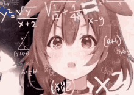

# Markdown Lesson
## Headling 2
### Headling 3
#### Headling 4
##### Headling 5
###### Headling level 6

####### Not a thing \
#Also doesn't work

- First item
- Second item
- Third item
- Fourth Item

* First item
* Second item
* Third item
	- Indented 1
	- Indented 2
	- Indented 3
* Fourth Item

+ First item
+ Second item
+ Third item
+ Fourth Item

## Add image




## Paragraphs
<p> Paragraphs </p>
another line <br>
Another thing

## Code block

```
public class test
{
	int test = 0;
}
```

## Blockquote

> test \
> another line
>> nested /indented

## Formatting

This text is **bold** \
This text is __bold__ \
This text is *italics* \
This text is _italics_ \
This text is ***Block Italics*** \
This text is ~~strikeout~~ \
~ is the above text
This text is ~subscript~ \
This text is ^superscript^ \
This text is ^^^superscript^^^ \
This text is ^^^^superscript^^^^ \
This text is ^^^^^superscript^^^^^ \

👑👑👑🤣🤣🤣

## Ordered list
<ol>
	<li>First item</li>
	<li>Second item</li>
	<li>Third item</li>
	<li>Fourth item</li>
</ol>